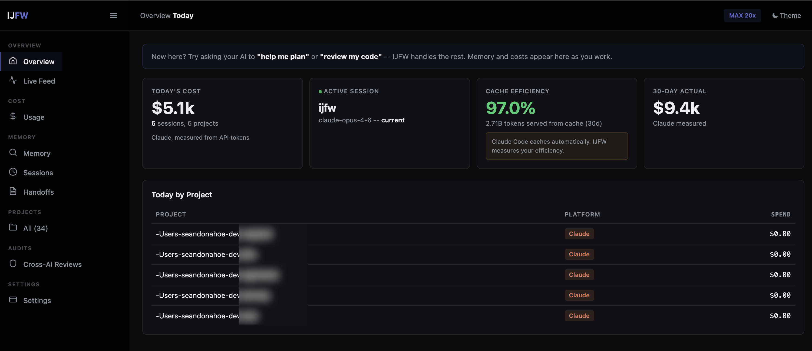

<p align="center">
  
</p>


[](https://www.npmjs.com/package/@ijfw/install)
[](LICENSE)

# IJFW (It Just F*cking Works!)

**Your AI is brilliant. It's also forgetful, undisciplined, alone, and it's quietly burning tokens you never needed to spend.** IJFW fixes all four with one install. Richest on Claude Code, connected through to Codex, Gemini, Cursor, Windsurf, and Copilot.  
  
Six AI agents sharing one local memory that survives every session, every project, every restart. One disciplined workflow drives anything you'd open an AI for: code, books, launches, research, businesses. From idea to ship.  
  
An on-demand three-AI critique puts a second lineage in the room so one model's blind spot never reaches production. Tasks dispatched to the right model for the job, output rules that strip the padding, prompt-cache discipline that compounds every session. Your bill goes down while your quality goes up.  
  
**Whatever AI tools you use today, whatever you switch to tomorrow, IJFW makes them work as one brain.** You bring the AI accounts you already use; IJFW adds nothing to pay for, runs entirely on your machine, and keeps every byte local.  
  
**Three seconds to install. Then your AI starts behaving like a senior partner that's already read the brief. And you start wondering how anyone still works the old way.**

* * *

## Install

```bash
npm install -g @ijfw/install && ijfw-install
```

Three seconds. Six AI coding agents configured. Nothing to log into.

**Windows** (PowerShell 5.1 or 7+):

```powershell
iwr https://raw.githubusercontent.com/TheRealSeanDonahoe/ijfw/main/installer/src/install.ps1 -OutFile install.ps1
.\install.ps1
```

**Preflight (all platforms):** Node 18 or newer, Git, and a bash shell (Git for Windows ships one). Windows users do not need WSL. If execution policy blocks the script, run PowerShell as `powershell -ExecutionPolicy Bypass -File .\install.ps1`.

What you see:

```
  +----------------------------------------+
  |                                        |
  |  IJFW  It just f*cking works.          |
  |                                        |
  +----------------------------------------+

  Installed at  ~/.ijfw

  ==> LIVE NOW (4)
      o  Claude Code
      o  Codex
      o  Gemini
      o  Copilot

  ==> STANDING BY (2)   auto-activate on install
      o  Cursor
      o  Windsurf

  ==> ONE MORE STEP   inside Claude Code
      /plugin marketplace add ~/.ijfw/claude
      /plugin install ijfw

  Full log   ~/.ijfw/install.log
```

**Live now** is the platforms on your machine, configured immediately. **Standing by** is every platform you do not yet have, pre-staged. Install Cursor next month and IJFW activates automatically. No rerun, no setup, no thought.

Every existing config gets a `.bak.<timestamp>` backup. Your existing MCP servers, model preferences, and per-project trust settings are preserved.

* * *

## Too lazy to type? Tell your AI to do it.

Copy this whole block, paste it into any AI coding agent you use (Claude Code, Codex, Cursor, Windsurf, Copilot), and hit enter. The agent will install IJFW, verify the MCP server is running, and prompt you to restart.

````
Install IJFW (It Just F*cking Works) on my machine with the one-command installer, then verify it is working.

Run this exactly:

  npm install -g @ijfw/install && ijfw-install

After it finishes, do these verifications and paste the results back to me:

  1. Run `ijfw doctor` -- expect a platform table showing which AI agents are live
  2. Run `ijfw --help` -- expect the full command list
  3. Check `~/.ijfw/claude/.mcp.json` exists and contains an absolute node path
  4. Run a quick MCP handshake test:
     echo '{"jsonrpc":"2.0","id":1,"method":"initialize","params":{"protocolVersion":"2024-11-05","capabilities":{}}}' | node ~/.ijfw/mcp-server/src/server.js | head -1
     expect a JSON response containing "result" and "ijfw-memory"

If anything fails, read the error from the installer log at ~/.ijfw/install.log and tell me what is broken.

When everything is green, tell me to fully exit my AI agent (not just a new tab -- full process quit) and restart it so IJFW loads on session start. Once restarted, run /mcp inside Claude Code to confirm plugin:ijfw:ijfw-memory shows as connected.
````

* * *

## Uninstall

One command reverses the install across every configured platform. Memory is preserved by default.

```bash
ijfw uninstall        # keeps ~/.ijfw/memory/ (recoverable on reinstall)
ijfw uninstall --purge  # also removes memory (destructive)
```

Equivalent aliases: `ijfw off` (same as `ijfw uninstall`), or `ijfw-uninstall` from the `@ijfw/install` npm package.

What gets removed: IJFW entries from `~/.claude/settings.json` (`mcpServers.ijfw-memory`, `enabledPlugins['ijfw@ijfw']`, `extraKnownMarketplaces.ijfw`), Codex / Gemini / Cursor / Windsurf / Copilot platform configs, `~/.ijfw/claude`, `~/.ijfw/mcp-server`, the `ijfw*` binaries from `~/.local/bin/`, and plugin cache under `~/.claude/plugins/cache/ijfw/`. Every modified file gets a `.bak.<timestamp>` first. Your other plugins, MCP servers, and per-project trust settings stay untouched.

* * *

## Preflight

**Run this before any publish or production deploy.** `ijfw preflight` executes an 11-gate quality pipeline in under 90 seconds on a warm cache and exits 0 only when every blocking gate passes.

```bash
ijfw preflight
```

| # | Gate | Blocks on fail? | What it catches |
|---|------|-----------------|-----------------|
| 1 | shellcheck | yes | Unbound variables, POSIX violations in hook scripts |
| 2 | oxlint | yes | Unused imports, dead variables in JS/TS |
| 3 | eslint-security | advisory | Security anti-patterns (non-literal fs paths, injection sinks) |
| 4 | psscriptanalyzer | advisory on macOS | PowerShell lint (blocking in Windows CI) |
| 5 | publint | yes | package.json bin/exports integrity |
| 6 | gitleaks | yes | Plaintext secrets and credentials |
| 7 | audit-ci | yes | npm audit: high and critical vulnerabilities |
| 8 | knip | advisory | Unused exports and dead code |
| 9 | license-check | advisory | Production dep license compatibility |
| 10 | pack-smoke | yes | `npm pack` -> temp install -> `ijfw --help` exits 0 |
| 11 | upgrade-smoke | yes | Plugin key wiring after upgrade from floor version |

Each gate uses `npx --yes <tool>@<pinned-version>` with versions tracked in `preflight-versions.json`. Missing tools are reported as "skipped" with a positive install hint. Preflight is optional -- it is not on the install path -- so the three-second install promise holds.

SLO: warm cache <=90s, cold cache <=240s. Both are printed in the summary line.

```
PASS 8  WARN 2  SKIP 1  FAIL 0
Time: 7s  within warm-cache SLO (<=90s)

All blocking gates passed.
```

* * *

## Dashboard

**A live window into every AI session across Claude, Codex, and Gemini.** Every PostToolUse event appends one JSONL line to `~/.ijfw/observations.jsonl`. The dashboard reads that ledger and streams new events to the browser in real time via SSE.

<p align="center">
  
</p>

Real numbers from one machine's 30-day window: $5.1k today across 5 active sessions, 97% cache efficiency, 2.71B tokens served from cache, $9.4k actual 30-day burn. Measured, not marketing.

```bash
ijfw dashboard start    # bind 127.0.0.1:37891, open browser
ijfw dashboard status   # show port + observation count
ijfw dashboard stop     # graceful shutdown
```

The web dashboard at `http://localhost:37891` is a single-file zero-dependency HTML page:

- Session timeline showing every tool call, file touched, and heuristic classification (bugfix, feature, change, discovery, decision).
- Filter bar narrows rows client-side -- no round-trips.
- Platform column color-coded: Claude (blue), Codex (purple), Gemini (green).
- Light and dark themes via `prefers-color-scheme`. Reduced-motion respected.
- "Load earlier" button for paginating past the default 200-row backfill.
- Port walk: if 37891 is busy, walks to 37900. Actual port written to `~/.ijfw/dashboard.port`.
- External requests (non-localhost) receive 403. Bound to 127.0.0.1 only.
- Zero runtime dependencies. `npm ls --production`: 0 entries.

The observation ledger feeds into a session summary written at SessionEnd: files read, files edited, what was learned, what ships next.

* * *

## What makes it feel smart

Three invariants run through every surface.

**On-demand skill loading.** IJFW ships 20 skills (workflow, commit, handoff, review, critique, compress, team setup, debug, memory audit, cross-audit, summarize, and more). Only the core skill (under 60 lines) is always loaded. Everything else hot-loads on trigger and unloads when done. Your context window stays lean; your token bill stays low.

**Natural-language invocation, context-aware.** Say "cross-audit this" and IJFW picks up the file you are looking at, the diff you just staged, or the range you just referenced. Say "plan this feature" and the workflow skill opens the Quick or Deep flow with the brief already seeded from your current conversation. You describe what you want; IJFW figures out the where.

**Installed-skill handoff.** IJFW notices the other Claude Code skills you already have and hands off at the right moment. UX/UI skills for design phases. Frontend-design for landing pages and layouts. Feature-dev, code-review, hookify, testing plugins, domain libraries, any skill you have installed. One line, one-word yes. No registries to maintain, no configuration. The skill you already paid for gets used at the phase where it earns its keep.

**Visual companion for software builds.** Design happens before build, not after. For Deep-mode software projects, IJFW offers a live visual companion the moment the brief locks: Mermaid diagrams for architecture, component boundaries, data model, API surface, and security posture. If you have a dedicated design skill installed (frontend-design, UX/UI), IJFW hands the visual off to it so you get real mockups, not just shapes. Written to `.ijfw/visual/`, refreshed at every phase audit, and diff-reviewed at ship so the picture never rots.

* * *

## The five engines

IJFW is not one thing. It is five connected engines under one install.

### 1\. Token economy

**Every prompt spends less to deliver more.** Your bill drops, your quality rises, and both are measurable at the end of every session.

In Claude Code, tasks get dispatched to the right model via sub-agent tiers: reads to Haiku, code to Sonnet, architecture to Opus. Across every platform, output rules strip the verbose preamble at the source and prompt-cache discipline compounds across sessions so your second turn is ten percent of the first turn's input cost. Every session ends with a receipt so the savings are not a claim, they are a log entry.

```
[ijfw] This session: ~14.3k tokens saved vs baseline (~$0.087)
[ijfw] Memory: 3 decisions stored, 1 Trident run on record.
[ijfw] Next: ship the auth migration after Trident review.
```

Typical observed: 25 percent or more output reduction vs an unmanaged baseline (same task, same prompt, no IJFW rules or routing applied). Your mileage varies by task, model, and cache state. The savings are logged per session, so you can audit every claim against your own metrics.

### 2\. Disciplined workflow

**The spine that stops AI coding from falling apart mid-session.** No skipped plans, no scope creep, no "I thought we agreed on X" arguments a week later. Every move visible, every gate user-signed.

IJFW ships an opinionated brainstorm, plan, execute, verify, ship spine. Two modes. Auto-picked from your prompt.

**Quick mode** (five moves, 3 to 5 minutes) for features, fixes, ideas. FRAME. WHY. SHAPE. STRESS. LOCK. Every move has one input slot. The AI proposes three approaches so you never face a blank page. A pre-mortem flash surfaces the risk you had not thought of. One word locks the brief.

**Deep mode** (six modules, 20 to 45 minutes) for new projects, major refactors, launches. FRAME. RECON. HMW. DIVERGE. CONVERGE. LOCK. Plus auto-triggered modules for external-facing briefs (mini PR / FAQ), anti-scope ("what we will not do"), and Trident cross-critique before the brief is finalized.

Every phase is conversational. One question at a time. No monologues. Every artifact is summarized in chat before it is written. Every gate is a user-facing checklist, not a silent pass. No "plan complete, 25 tasks ready to dispatch" surprises.

### 3\. Custom agent teams, generated on demand per project

**A bench of specialists built for the project you are actually running, not a generic kit.** IJFW studies what you are building, then generates the exact team that fits, the moment you need it.

The `ijfw-team` skill fires on the first session of a new project. It reads what you are doing, detects the domain, and generates a purpose-built bench: software gets architect, senior dev, security, qa. Fiction gets story architect, world builder, lore master. Campaign gets strategist, copywriter, brand lead. Research gets investigator, synthesist, fact-checker. Every agent is written to fit **this** project's stack, **this** project's conventions, **this** project's constraints. They are saved to `.ijfw/agents/`, swappable with one command, and dispatched automatically when a task matches their role.

Plus a permanent **specialist swarm** that runs alongside your team for hard problems: `code-reviewer`, `silent-failure-hunter`, `pr-test-analyzer`, `type-design-analyzer`. Dispatched in parallel during cross-audit and verify phases.

### 4\. Connected memory

**Your AI stops being amnesiac, and your memory stops being a dumping ground.** What matters gets promoted. What went stale gets pruned. What contradicts itself gets reconciled. Every session makes the next one smarter.

Decisions, patterns, handoffs, and journal entries persist as plain markdown in `.ijfw/memory/`. Three tiers, plus a dream cycle that cleans the memory the same way a rested mind does.

| Tier | Shape | When it runs |
|------|-------|--------------|
| Hot  | Plain markdown | Always on. Instant reads. Git friendly. |
| Warm | BM25 ranked retrieval | Always on. Scales to around 10,000 entries. |
| Cold | Optional semantic vectors via `@xenova/transformers` | Only if installed. Off by default. |

Eight MCP tools talk to that memory from every supported AI. Cross-project search lets you find a decision from a different project two months ago. The team tier (`.ijfw/team/`) is git-committed so your team's conventions ride along with the repo. A new hire's first session inherits all of it.

**Dream reconciliation.** On demand (`/consolidate` or "run a dream cycle"), IJFW sweeps your memory: it promotes observed patterns into the knowledge base, prunes stale entries, reconciles contradictions, and optionally lifts winners into your global memory so every future project benefits. You end up with a memory that grows sharper over time instead of heavier.

### 5\. Multi-AI Trident

**Never trust the output of one AI when you can use three to check each other's work.** The Multi-AI Trident is Sean Donahoe's IJFW method for killing single-model blind spots: one OpenAI-lineage model, one Google-lineage model, and a Claude specialist swarm all reviewing the same target in parallel. Disagreement is data. Consensus is a green light. Silence is never an answer.

```bash
ijfw cross audit src/auth.js
```

Codex and Gemini audit your file in parallel. Findings tagged **consensus** (both AIs agree, high priority) or **contested** (they disagree, your judgment call). The Claude specialist swarm runs alongside on the same target. Receipts logged locally with cache savings, duration, and findings count.

Default Trident picks two auditors from different lineages so blind spots do not compound. Background fires by default so you keep working while the audit runs. Every commit can auto-fire Trident via the optional post-commit hook. The method travels with the memory, the receipts, and the brief, so every future decision inherits the scrutiny.

* * *

## The 30-second test drive

Every command ships in three forms: a Claude Code slash command, a shell command, and a natural-language phrase. Use whichever fits the moment.

**Health check.** Probes every AI CLI and API key on your machine. Tells you what is live, what is standing by, and the literal command to enable each one. No mystery.

```
/doctor
ijfw doctor
"run the doctor"
```

**Cross-AI audit.** Two AIs from different lineages review your file in parallel. Findings tagged consensus or contested.

```
/cross-audit src/auth.js
ijfw cross audit src/auth.js
"cross-audit this file"     (IJFW picks up the file from context)
```

**Import from another tool.** Already using `claude-mem`, `RTK`, or another memory tool? IJFW absorbs what it can into your local markdown. Idempotent. `--dry-run` shows what would happen first. Zero data loss.

```
/import claude-mem --dry-run
ijfw import claude-mem --dry-run
"import my claude-mem memory"
```

Importers in v1.0: `claude-mem` (full, SQLite). `rtk` (metrics-only, opt-in). More tools land through point releases. If you have a memory tool IJFW should absorb, the `ijfw import` contract is open and documented.

* * *

## What's in the box

### The Claude Code plugin (richest integration)

-   **Slash commands for every move**: `/workflow`, `/handoff`, `/cross-audit`, `/cross-research`, `/cross-critique`, `/memory-audit`, `/memory-consent`, `/memory-why`, `/metrics`, `/mode`, `/team`, `/consolidate`, `/compress`, `/status`, `/doctor`, `/ijfw-plan`, `/ijfw-execute`, `/ijfw-verify`, `/ijfw-ship`, `/ijfw-audit`, `/ijfw` (help).
    
-   **9 deterministic bash hooks**: SessionStart (memory injection + welcome-back beat), SessionStart-dashboard (auto-spawn local observability), SessionEnd (token-savings receipt + memory pointer), UserPromptSubmit (vague-prompt detector) + its capture pair, PreToolUse (pattern detection), PostToolUse (output trim + signal capture), PreCompact (session preservation), Observation-capture.
    
-   **20 on-demand skills**: workflow, memory, commit, handoff, review, critique, compress, team setup, debug, cross-audit, design, recall, dashboard, preflight, and more. Hot-loaded when triggered, unloaded when done.
    

### The MCP memory server

Node.js. 40 KB. Zero runtime dependencies. Stdio transport. No sockets, no daemon, no listening port. Eight tools at the CLAUDE.md cap of 8.

| Tool | Purpose |
|------|---------|
| `ijfw_memory_recall` | Wake up with full project context. Cross-project via `from_project`. |
| `ijfw_memory_store` | Persist decisions, patterns, handoffs, preferences, observations. |
| `ijfw_memory_search` | BM25-ranked search over local memory. `scope:"all"` for cross-project. |
| `ijfw_memory_status` | Roughly 200-token project brief. Mode, pending, last handoff. |
| `ijfw_memory_prelude` | Full first-turn memory bundle for agents without SessionStart hooks. |
| `ijfw_prompt_check` | Deterministic regex detector for vague prompts. Zero LLM cost. |
| `ijfw_metrics` | Tokens, cost, routing mix, session totals. |
| `ijfw_cross_project_search` | BM25 across every registered IJFW project on the machine. |

Hard cap at 8. Every tool earns its slot or it gets cut.

### The `ijfw` CLI

```
ijfw install                       Install IJFW into your AI coding agents.
ijfw preflight                     Run 11-gate quality pipeline (blocking + advisory).
ijfw dashboard start               Start localhost:37891 SSE dashboard (opens browser).
ijfw dashboard stop                Graceful shutdown.
ijfw dashboard status              Port + observation count.
ijfw status                        Hero line + recent runs + cache savings.
ijfw doctor                        CLI + API-key reachability with literal fix commands.
ijfw cross audit <file>            Codex + Gemini adversarial review.
ijfw cross research "<topic>"      Multi-source research.
ijfw cross critique <range>        Structured counter-argument generation.
ijfw cross project-audit <rule>    Same audit across every registered IJFW project.
ijfw import claude-mem             Absorb claude-mem SQLite memory into local markdown.
ijfw update                        Pull latest + reinstall merge-safely.
ijfw receipt last                  Redacted, shareable block from the last Trident run.
```

### Six platforms, one install, one workflow

| Platform | What ships |
|----------|------------|
| Claude Code | Native plugin via marketplace, MCP auto-registered, 9 hooks, 20 on-demand skills, 21 slash commands |
| Codex CLI | Native plugin (`.codex-plugin/plugin.json`), 20 skills, 9 hooks, MCP registered, marketplace-ready |
| Gemini CLI | Native extension (`gemini-extension.json`), 20 skills, 11 hook events, 21 TOML slash commands, policy engine, BeforeModel injection, checkpointing; observation ledger + dashboard write |
| Cursor | `.cursor/mcp.json` + `.cursor/rules/ijfw.mdc`; dashboard view-only (no hook lifecycle) |
| Windsurf | `~/.codeium/windsurf/mcp_config.json` + `.windsurfrules`; dashboard view-only |
| Copilot (VS Code) | `.vscode/mcp.json` + `.github/copilot-instructions.md`; dashboard view-only |
| Universal | `universal/ijfw-rules.md`, paste into anything else |

### Observation + dashboard parity

| Platform | Writes observations | Dashboard (read) | Hook lifecycle |
|----------|--------------------|--------------------|----------------|
| Claude Code | yes (PostToolUse hook) | yes | full |
| Codex CLI | yes (PostToolUse hook) | yes | full |
| Gemini CLI | yes (AfterTool hook) | yes | full |
| Cursor | view-only | yes | none |
| Windsurf | view-only | yes | none |
| Copilot | view-only | yes | none |

Claude, Codex, and Gemini write one JSONL line per tool call. Cursor, Windsurf, and Copilot have no hook lifecycle IJFW can write from, so they read the shared ledger via the dashboard instead.

Same engine behind all of them. Native affordances on each.

* * *

## How they connect

```
  Your prompt
       v
  +----------------------------------------------+
  |  IJFW Core (rules + workflow skill + auto)   |
  +----------------------------------------------+
       |              |            |            |
       v              v            v            v
   Token economy   Workflow     Teams        Memory
   (right model,   (Quick and   (per-project  (8 MCP tools,
    output rules,   Deep modes,  agents +      hot, warm,
    cache)          audit gates) swarm)        cold)
       |              |            |            |
       +--------------+------+-----+------------+
                            |
                            v
                +-------------------------+
                |   Multi-AI Trident      |
                | (Codex + Gemini +       |
                |  Claude specialists)    |
                +-------------------------+
                            |
                            v
                     Receipt + Memory
```

Five engines. One workflow. One memory. One Trident. One install.

* * *

## Cross-platform parity

| Capability | Claude Code | Shell CLIs | Natural language |
|------------|-------------|------------|------------------|
| Status | `/status` | `ijfw status` | "what's my status?" |
| Health check | `/doctor` | `ijfw doctor` | "run the doctor" |
| Cross audit | `/cross-audit` | `ijfw cross audit <file>` | "cross audit this file" |
| Cross research | `/cross-research` | `ijfw cross research <topic>` | "research this topic" |
| Cross critique | `/cross-critique` | `ijfw cross critique <range>` | "critique the last commit" |
| Handoff | `/handoff` | `ijfw handoff` | "save a handoff" |
| Plan | `/ijfw-plan` | (via workflow) | "plan this feature" |
| Ship | `/ijfw-ship` | (via workflow) | "ship it" |
| Preflight | (via skill trigger) | `ijfw preflight` | "run preflight" |
| Observations | (auto on PostToolUse) | `~/.ijfw/observations.jsonl` | built-in |
| Dashboard | (via skill trigger) | `ijfw dashboard start` | "open the dashboard" |

**Natural language is a first-class input.** In any IJFW-enabled agent, saying "cross audit this file" or "let's cross-audit the auth module" routes to the same engine as the slash command, and the target is picked up from context (your current file, your last commit, your open diff). You do not have to remember syntax. You do not have to copy a path. You tell the agent what you want and it figures out the where.

* * *

## What this isn't

**Not a SaaS.** No IJFW account, no IJFW dashboard, no IJFW subscription, no IJFW rate limits. There is nothing to log into.

**Not a wrapper.** IJFW does not proxy your AI traffic. It configures the agents you already have so they share memory and discipline. When `ijfw cross` fires, it goes through your existing CLI or your existing API key.

**Not a framework.** You do not write code against IJFW. Install it once and the AI tools you already use get smarter, leaner, and connected. Ignore it for weeks and then say "recall my project" to drop back into context.

**Not a vendor's lock-in.** Your memory is markdown in your repo. Your audit receipts are JSONL on your disk. Your config is a backed-up file. Walk away whenever you like. Your data walks with you.

**Not magic.** It is deterministic bash, Node, plain markdown, and opinionated rules. Inspect every byte. Fork it. Diff next month's release.

* * *

## Privacy

**Your code and memory never leave your machine unless you ask them to.**

-   IJFW itself is zero-telemetry, zero-cloud, zero-account. It never phones home.
    
-   The MCP server speaks stdio only. No sockets. No daemon. No listening port.
    
-   Hooks are deterministic bash. No LLM calls from hooks.
    
-   All memory (`.ijfw/memory/`) is plain markdown on your disk.
    

The only time bytes leave is when **you** invoke `ijfw cross`, and then only to the external AI auditor you have already configured (your existing CLI or your existing API key). Every cross-AI run is logged in a local receipt and capped by a per-session spend limit (default $2, configurable via `IJFW_AUDIT_BUDGET_USD`).

Full accounting in [NO\_TELEMETRY.md](NO_TELEMETRY.md). Every data path, every file location, every "does this leave your machine?" answered in a table.

* * *

## FAQ

**Is this just a Claude Code plugin?**  
No. Claude Code is one of six platforms. The plugin is richest there because Claude Code exposes the most integration points. Every capability is available on the other five through their native MCP and rules-file integrations.

**Do I need a specific AI provider?**  
No. IJFW configures the agents you already have. Bring your own keys, your own CLIs. The Trident uses whatever auditors are reachable on your machine. One is enough to start.

**What does IJFW cost me?**  
Runtime: zero npm dependencies. Tokens: the cross-AI Trident uses your existing API keys with a configurable per-session spend cap (default $2). Memory storage: kilobytes of markdown in your repo. Smart routing typically saves you more than the cap costs.

**Is the token-savings claim real?**  
Yes, and verifiable in your own metrics. Sources: right-model dispatch (a cheaper tier when adequate, the heavyweight when needed), prompt cache discipline (Anthropic cache hits for repeated context), output rules that cut the padding, context discipline that stops re-pasting. Typical observed: 25 percent or more output reduction vs unmanaged baseline. The log is in your project.

**Can I turn it off?**  
Yes. `ijfw off` disables the core skill. Each command is isolated. The MCP server can be unregistered per platform. Backups are timestamped. Nothing is sticky.

**What about my existing memory in claude-mem or other tools?**  
`ijfw import claude-mem` round-trips the SQLite store into IJFW markdown. Idempotent. Safe to rerun. `--dry-run` shows what would happen first.

**Will it slow my sessions down?**  
MCP handshake is about 50 ms. Hooks are under 30 ms. Memory recall across thousands of entries is under 10 ms. No perceptible overhead.

**How do I update?**  
`ijfw update` pulls latest and reinstalls merge-safely. Your memory is preserved.

* * *

## Get started

```bash
npm install -g @ijfw/install && ijfw-install
```

One command. Restart your AI. It just fucking works.

Open any project in Claude Code, Codex, Gemini, Cursor, Windsurf, or Copilot. Your AI wakes up with memory loaded, tokens optimized, workflow ready, and the Trident a `cross audit` away.

* * *

## Credits / Prior Art

**ijfw-design** structure takes inspiration from the excellent **ui-ux-pro-max** and **frontend-design** Claude Code plugins. Our knowledge base is independently curated from WCAG 2.2, Apple Human Interface Guidelines 2025, Material Design 3, and W3C accessibility standards. No data was copied.

**CodeBurn** -- observability data model that inspired IJFW's ledger and session metrics.
**claude-mem** -- memory tool whose import contract informed IJFW's memory absorption layer.

---

## Why this exists

I'm Sean Donahoe. Two decades in product, AI, and trading systems. I built IJFW because I refused to keep paying for context loss, undisciplined sessions, and one-model blind spots.

The big AI labs are not going to fix this. Continuity, discipline, and second opinions are the only things they have to lose. So I built it locally. Markdown, bash, one MCP server. No vendor can take it from you.

If you ship code with AI, you need this. If you write with AI, run a business with AI, plan a launch with AI, you need this. If your team works with AI, you really need this.

* * *

[github.com/TheRealSeanDonahoe/ijfw](https://github.com/TheRealSeanDonahoe/ijfw) | [MIT License](LICENSE) | [Changelog](CHANGELOG.md) | Local-only. No telemetry, no account, no cloud. One install, six platforms, five engines, three AI families, zero apologies.

**Install it. Inspect it. Fork it. Ship it. It just fucking works.**