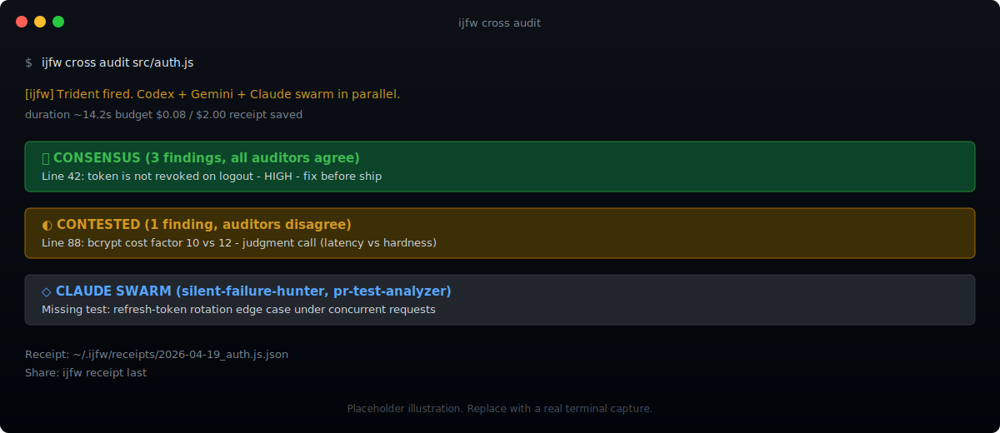
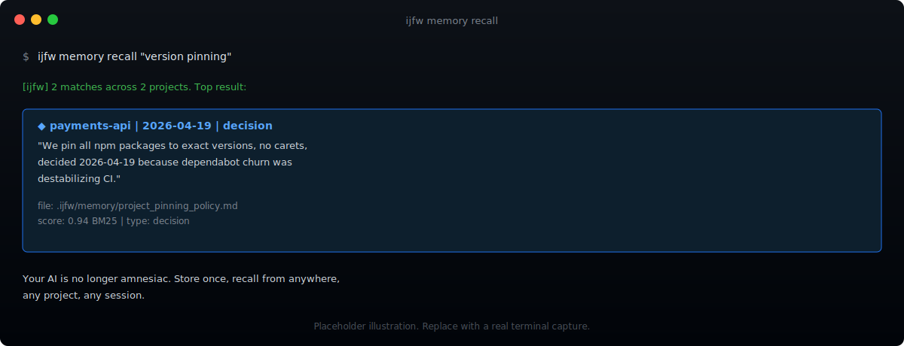
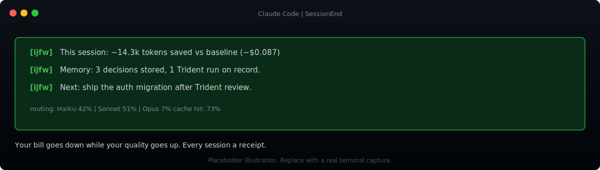

<p align="center">
  
</p>

# The IJFW Guide

**90 seconds to your first win. 10 minutes to the full tour. 45 minutes to master it.**

This guide is bundled with every install. Run `ijfw help` in your terminal for the terminal-native version, or `ijfw help --browser` to read it in a rendered browser tab with images and syntax highlighting.

---

## Table of contents

**Part 1: Quickstart**
- [Install](#install)
- [Three quick wins in 90 seconds](#three-quick-wins-in-90-seconds)
- [The 10-minute tour](#the-10-minute-tour)
- [What to do tomorrow](#what-to-do-tomorrow)

**Part 2: Reference**
- [Command reference](#command-reference)
- [Skill reference](#skill-reference)
- [Workflow modes](#workflow-modes)
- [Platform parity](#platform-parity)
- [Configuration and environment](#configuration-and-environment)
- [Privacy and data handling](#privacy-and-data-handling)
- [Troubleshooting](#troubleshooting)
- [FAQ](#faq)

---

# Part 1: Quickstart

## Install

One command. Three seconds.

```bash
npm install -g @ijfw/install && ijfw-install
```

That installs the npm package, runs the installer, and wires up every AI coding agent it finds on your machine. Claude Code, Codex, Gemini, Cursor, Windsurf, and Copilot all pick up the shared memory and the same workflow discipline.

If you do not type commands, paste this block into Claude Code, Cursor, or any other AI coding agent. It will install IJFW for you, verify the MCP server handshake, and tell you when to restart.

```
Install IJFW (It Just F*cking Works) on my machine with the one-command installer, then verify it is working.

Run this exactly:

  npm install -g @ijfw/install && ijfw-install

After it finishes, run ijfw doctor and paste the result. Tell me if anything is red, then tell me to restart my AI agent so IJFW loads on session start.
```

After the install finishes, fully quit your AI agent (Cmd+Q on macOS, not just a new tab) and relaunch it. IJFW loads on session start.

---

## Three quick wins in 90 seconds

Every feature in IJFW is designed to pay off in under a minute. These three are the ones to try first, in order. Each runs in seconds and each shows you something your AI could not do before.

### Win 1: Your first cross-audit (30 seconds)

Pick any file you own. Run this.

```bash
ijfw cross audit src/anything.js
```

Two external AIs from different lineages (one OpenAI-family, one Google-family) review the same file in parallel. Your Claude specialist swarm runs alongside. Findings are tagged **consensus** (all three agree, high priority) or **contested** (they disagree, your judgment call).



Consensus means the single-model blind spot is gone. Contested means you are looking at a real engineering tradeoff, not a bug. Either way, the audit receipt is written to `~/.ijfw/receipts/` with full cost accounting, duration, and findings count. You can share any receipt with `ijfw receipt last`.

In Claude Code, the same runs as `/cross-audit <file>` or simply "cross-audit this" when a file is in your conversation context. In other agents, use the shell form.

### Win 2: Your first memory round-trip (45 seconds)

Tell IJFW a decision in one session. Ask for it in another. No configuration required.

**Session A, any project:**

```bash
ijfw memory store "We pin all npm packages to exact versions, no carets, decided 2026-04-19 because dependabot churn was destabilizing CI."
```

**Session B, a completely different project, hours or days later:**

```bash
ijfw memory recall "version pinning"
```

It comes back. Full quote, original date, original project. Your AI is no longer amnesiac.



All memory lives as plain markdown in `.ijfw/memory/` inside each project. Three tiers run automatically: hot (always-on instant reads), warm (BM25 ranked retrieval, scales to ten thousand entries), cold (optional semantic vectors, off by default). You can `cat` any memory file. You can `grep` any memory file. You can commit the ones you want your team to see.

Inside Claude Code this surfaces as "recall X" in plain language. Outside, use the shell form.

### Win 3: Your first observability view (15 seconds)

Start the local dashboard. One command.

```bash
ijfw dashboard start
```

Browser opens on `http://localhost:37891`. Every tool call every AI makes on your machine is already in the ledger (PostToolUse hooks capture in Claude Code, Codex, and Gemini by default). The dashboard just renders it.


What you see above is a real IJFW user's month: $5.1k in spend today across five active sessions, 97% cache efficiency (2.71 billion tokens served from cache in 30 days), $9.4k actual 30-day burn. Those numbers are measured, not marketing. The bar they set is the bar your own dashboard will read against.

Every session also ends with a terminal receipt so the savings show up where you already work.

```
[ijfw] This session: ~14.3k tokens saved vs baseline (~$0.087)
[ijfw] Memory: 3 decisions stored, 1 Trident run on record.
[ijfw] Next: ship the auth migration after Trident review.
```



You now have three things your AI could not do this morning: a Trident that kills single-model blind spots, a memory that survives every restart, and a bill that goes down while the quality goes up. The rest of this guide shows you what else is in the box.

---

## The 10-minute tour

### The workflow spine

Every IJFW command sits on top of one opinionated workflow: **Think, Build, Ship**. IJFW picks the right mode from your prompt automatically. You do not pick. You just describe what you want to do.

**Quick mode** (three to five minutes) runs five moves for features, bug fixes, and ideas: FRAME, WHY, SHAPE, STRESS, LOCK. Every move has one input slot. The AI proposes three approaches so you never face a blank page. A pre-mortem flash surfaces the risk you had not thought of. One word locks the brief.

**Deep mode** (twenty to forty-five minutes) runs six modules for new projects, major refactors, and launches: FRAME, RECON, HMW, DIVERGE, CONVERGE, LOCK. Plus auto-triggered modules for external-facing briefs (mini PR and FAQ), anti-scope ("what we will not do"), and Trident cross-critique before the brief is finalized.

Every phase is conversational. One question at a time. No monologues. Every artifact summarizes in chat before it writes to disk. Every gate is a user-facing checklist, never a silent pass.

To start: say "let's plan a new feature", "help me ship this", or "let's build X". In Claude Code the same triggers as `/workflow` or `/ijfw-plan`.

### The observability dashboard

Every tool call every AI makes on your machine writes one line to `~/.ijfw/observations.jsonl`. The dashboard reads that ledger and streams new events to your browser in real time.

```bash
ijfw dashboard start
```

That binds to `127.0.0.1:37891` and opens a tab. You see the session timeline for every tool call, what file was touched, and a heuristic classification (bugfix, feature, change, discovery, decision). Filter by platform (Claude blue, Codex purple, Gemini green). The observation ledger feeds into the SessionEnd receipt.

Port is local only. External requests get a 403. Zero runtime dependencies. The whole dashboard is one HTML file, one JS file, one SSE stream.

### Agent teams, generated per project

The first time you run IJFW on a new project, the `ijfw-team` skill reads what you are building, detects the domain, and generates a purpose-built bench. A software project gets architect, senior dev, security, qa. A fiction project gets story architect, world builder, lore master. A campaign gets strategist, copywriter, brand lead. Every agent fits this project's stack and this project's constraints, not a generic kit.

Teams live in `.ijfw/agents/`. Swap with one command. Dispatched automatically when a task matches their role.

Plus a permanent specialist swarm that runs alongside your team for hard problems: `code-reviewer`, `silent-failure-hunter`, `pr-test-analyzer`, `type-design-analyzer`. Dispatched in parallel during cross-audit and verify phases.

Run `/team setup` in Claude Code, or `ijfw team` from the shell, to see your current bench.

### Memory tiers, explained in one minute

| Tier | Shape | When it runs |
|------|-------|--------------|
| Hot  | Plain markdown in `.ijfw/memory/` | Always on. Instant reads. Git friendly. |
| Warm | BM25 ranked search | Always on. Scales to around 10,000 entries per project. |
| Cold | Optional semantic vectors | Only if you install `@xenova/transformers`. Off by default. |

Every session also ends with an optional "dream cycle". Run `/consolidate` or "run a dream cycle" to have IJFW sweep the day's memory: promote observed patterns into your knowledge base, prune stale entries, reconcile contradictions, optionally lift winners into global memory so every future project benefits. Memory that grows sharper over time instead of heavier.

### Smart routing and the token economy

Inside Claude Code, tasks dispatch to the right model automatically. Reads go to Haiku, code goes to Sonnet, architecture goes to Opus. Across every platform, output rules strip verbose preamble at the source and prompt-cache discipline compounds across sessions so your second turn costs roughly ten percent of the first turn's input.

Typical observed saving: 25 percent or more output reduction versus an unmanaged baseline (same task, same prompt, no IJFW rules or routing applied). Your mileage varies by task, model, and cache state. The savings print in every session receipt so you can audit every claim against your own logs.

To see the running total with a breakdown by platform and session:

```bash
ijfw metrics
```

---

## What to do tomorrow

By tomorrow your AI already feels different. Three small habits compound the effect.

1. **End every significant session with `ijfw handoff`.** It writes a short file other sessions can pick up from. New session, say "recall" or `/handoff`, and you are back in context instantly.

2. **Run `ijfw cross audit` before you merge anything meaningful.** Even if you are the only reviewer, the Trident is a second opinion that costs pennies and catches what single-model eyes miss. Most IJFW users wire it into their git post-commit hook after a week.

3. **Say "consolidate" once a week.** The dream cycle keeps memory sharp. Without it, memory grows heavier instead of smarter.

Everything else in IJFW builds on those three habits. Part 2 below is the full reference if you want to see every command and every skill.

---

# Part 2: Reference

## Command reference

Every command ships in three forms: a shell command, a Claude Code slash command, and a natural-language phrase. Use whichever fits the moment.

### Install and lifecycle

| Command | Purpose |
|---------|---------|
| `ijfw install` | Install or re-install IJFW into every detected agent. Idempotent. Backs up every modified config. |
| `ijfw uninstall` | Reverse install. Preserves `~/.ijfw/memory/` by default. |
| `ijfw uninstall --purge` | Also remove memory. Destructive. |
| `ijfw off` | Alias for `ijfw uninstall`. |
| `ijfw update` | Pull latest, reinstall merge-safely. Your memory is preserved. |

### Daily drivers

| Command | Purpose |
|---------|---------|
| `ijfw status` | Hero line plus recent activity plus cache savings. |
| `ijfw doctor` | Probe every AI CLI and API key. Tells you what is live and what is standing by. |
| `ijfw help` | Show this guide, paged. Add `--browser` to render in a browser tab. |
| `ijfw handoff` | Save a context handoff for the next session. |
| `ijfw receipt last` | Print the last Trident receipt, redacted and shareable. |

### Memory

| Command | Purpose |
|---------|---------|
| `ijfw memory store "<text>"` | Persist a decision, pattern, or note. |
| `ijfw memory recall "<query>"` | BM25 ranked search over local memory. |
| `ijfw memory status` | Roughly 200-token project brief. Mode, pending, last handoff. |
| `ijfw memory search --scope all "<query>"` | Search across every registered IJFW project on this machine. |
| `ijfw import claude-mem` | Absorb existing claude-mem SQLite memory into IJFW markdown. |
| `ijfw import claude-mem --all` | Discover projects automatically, import in bulk. |
| `ijfw import claude-mem --dry-run` | Show what would happen first. |

### Multi-AI Trident

| Command | Purpose |
|---------|---------|
| `ijfw cross audit <file>` | Two external AIs plus the Claude swarm review one file. |
| `ijfw cross research "<topic>"` | Multi-source research across two AI families. |
| `ijfw cross critique <range>` | Structured counter-argument generation for a diff or commit. |
| `ijfw cross project-audit <rule>` | Same audit across every registered IJFW project. |

### Observability

| Command | Purpose |
|---------|---------|
| `ijfw dashboard start` | Bind `127.0.0.1:37891`, open the dashboard tab. |
| `ijfw dashboard stop` | Graceful shutdown. |
| `ijfw dashboard status` | Port plus observation count. |
| `ijfw metrics` | Tokens, cost, routing mix, session totals. |

### Quality gates

| Command | Purpose |
|---------|---------|
| `ijfw preflight` | Run the 11-gate quality pipeline. Blocking plus advisory. |
| `ijfw preflight --fail-fast` | Stop on the first blocking failure. |
| `ijfw preflight --json` | Emit machine-readable output (CI integration). |

Every command accepts `--help`. Every command prints positive messages when it runs and specific next-step guidance when it cannot.

---

## Skill reference

Skills in Claude Code are on-demand capability modules. Only the core IJFW skill (around 55 lines) is always loaded. Everything else hot-loads when triggered and unloads when done.

### Always on (one skill, under 60 lines)

- **`ijfw-core`**: smart output, routing, context discipline. Toggle with "ijfw off" or "normal mode".

### Workflow and planning

- **`ijfw-workflow`**: universal Think, Build, Ship flow. Auto-picks Quick or Deep mode from your prompt.
- **`ijfw-plan-check`**: audit gate before execution. Fires on "audit plan", "review plan", "before we build".
- **`ijfw-preflight`**: runs the 11 quality gates before any ship.
- **`ijfw-team`**: generates a purpose-built agent team for this project the first time IJFW sees it.

### Multi-AI cross-check

- **`ijfw-cross-audit`**: two external AIs plus Claude swarm adversarial review.
- **`ijfw-critique`**: poke holes, surface counter-arguments, flag assumptions.

### Memory and continuity

- **`ijfw-recall`**: surface relevant memory at session start or on demand.
- **`ijfw-handoff`**: session handoff generation and loading.
- **`ijfw-memory-audit`**: audit and clean project memory files.
- **`ijfw-auto-memorize`**: session-end auto-extraction of lessons, errors, and user feedback.

### Writing and shipping

- **`ijfw-commit`**: terse conventional commits.
- **`ijfw-debug`**: root-cause analysis with hypothesis tracking.
- **`ijfw-design`**: first-class design intelligence. Dispatches to installed design skills.
- **`ijfw-summarize`**: generate optimized project context from a codebase scan.

### Observability

- **`ijfw-dashboard`**: control the observation dashboard from within your session.

### System

- **`ijfw-recall`**, **`ijfw-memory-consent`**, **`ijfw-update`** cover the remaining slots.

Full list in Claude Code: run `/ijfw` or just type `ijfw` in conversation to see the command index.

---

## Workflow modes

IJFW auto-picks from your prompt. You can also pick explicitly with `ijfw-plan quick` or `ijfw-plan deep`.

### Quick mode (3 to 5 minutes)

Five moves. One input each. Use for features, bug fixes, experiments, ideas.

| Move | What happens |
|------|--------------|
| FRAME | One sentence. What problem, for whom, by when? |
| WHY | One sentence. Why now? What changes if this ships? |
| SHAPE | Three candidate approaches. Pick one. |
| STRESS | Pre-mortem flash. One risk surfaces. You acknowledge it. |
| LOCK | Brief finalizes. You type one word (ship, revise, kill). |

### Deep mode (20 to 45 minutes)

Six modules. Conversational. Used for new projects, major refactors, launches.

| Module | What happens |
|--------|--------------|
| FRAME | Problem, audience, constraints, outcome. |
| RECON | Codebase and domain scan. What is already solved? |
| HMW | "How might we" divergent thinking. Many angles. |
| DIVERGE | Four or five candidate shapes, each with tradeoffs. |
| CONVERGE | Rank, pick, justify. |
| LOCK | Full brief writes to disk. |

Auto-triggered extras when they apply: mini PR and FAQ (external-facing features), anti-scope ("what we will not do"), Trident cross-critique (before the brief is finalized).

Every module is a single question, answered in chat. Artifacts summarize in chat before they write. Every gate is user-signed. No silent passes, no "plan complete, 25 tasks ready to dispatch" surprises.

---

## Platform parity

IJFW configures six AI coding agents with native affordances on each, plus a universal rules file you can paste into anything else.

| Platform | What ships |
|----------|------------|
| Claude Code | Native plugin via marketplace, MCP auto-registered, 9 hooks, 20 on-demand skills, 21 slash commands |
| Codex CLI | Native plugin (`.codex-plugin/plugin.json`), 20 skills, 9 hooks, MCP registered, marketplace-ready |
| Gemini CLI | Native extension (`gemini-extension.json`), 20 skills, 11 hook events, 21 TOML slash commands, policy engine, BeforeModel injection, checkpointing |
| Cursor | `.cursor/mcp.json` plus `.cursor/rules/ijfw.mdc`. Dashboard view-only. |
| Windsurf | `~/.codeium/windsurf/mcp_config.json` plus `.windsurfrules`. Dashboard view-only. |
| Copilot (VS Code) | `.vscode/mcp.json` plus `.github/copilot-instructions.md`. Dashboard view-only. |
| Universal | `universal/ijfw-rules.md`. Paste into anything else. |

### Observation ledger parity

| Platform | Writes observations | Dashboard (read) | Hook lifecycle |
|----------|---------------------|------------------|----------------|
| Claude Code | yes (PostToolUse hook) | yes | full |
| Codex CLI   | yes (PostToolUse hook) | yes | full |
| Gemini CLI  | yes (AfterTool hook)   | yes | full |
| Cursor      | view-only              | yes | none |
| Windsurf    | view-only              | yes | none |
| Copilot     | view-only              | yes | none |

Claude, Codex, and Gemini write one JSONL line per tool call. Cursor, Windsurf, and Copilot have no hook lifecycle IJFW can write from, so they read the shared ledger via the dashboard instead. Same engine behind all of them.

---

## Configuration and environment

IJFW is zero-config by default. Everything below is optional.

### Environment variables

| Variable | What it does |
|----------|--------------|
| `IJFW_HOME` | Override the install location. Default: `~/.ijfw`. |
| `IJFW_AUDIT_BUDGET_USD` | Per-session spend cap for cross-AI auditors. Default: 2. |
| `IJFW_MODE` | `smart`, `fast`, `deep`, `manual`, or `brutal`. Default: smart. |
| `NODE_PATH` | The installer absolute-resolves the node binary path into `.mcp.json` so MCP spawns do not depend on PATH. |

### Files you can safely edit

| File | Purpose |
|------|---------|
| `~/.ijfw/settings.json` | Overrides for mode, routing, and audit budget. |
| `.ijfw/memory/*.md` | Project-level memory. Plain markdown. Commit or gitignore as you prefer. |
| `.ijfw/team/*.md` | Team-level memory. Commit these so teammates inherit. |

### Files IJFW manages for you

| File | Purpose |
|------|---------|
| `~/.ijfw/observations.jsonl` | The observation ledger. |
| `~/.ijfw/receipts/` | Trident receipts. One per cross-audit. |
| `~/.ijfw/install.log` | Install history. Append-only. |
| `~/.ijfw/dashboard.port` | Dashboard port if it walked from 37891. |

Every file IJFW writes is plain text or JSON. No binaries, no caches you cannot inspect.

---

## Privacy and data handling

**Your code and memory never leave your machine unless you ask them to.**

- IJFW itself is zero-telemetry, zero-cloud, zero-account. No analytics, no phone-home.
- The MCP server speaks stdio only. No sockets. No daemon. No listening port.
- Hooks are deterministic bash. No LLM calls from hooks.
- All memory lives in `.ijfw/memory/` as plain markdown on your disk.

The only time bytes leave your machine: when you invoke `ijfw cross`. Even then, the audit fires against the external AI providers you have already configured (your existing CLI or your existing API key). Every cross-AI run is logged in a local receipt. Every cross-AI run is capped by a per-session spend limit (default two dollars, configurable via `IJFW_AUDIT_BUDGET_USD`).

Full accounting: [NO_TELEMETRY.md](../NO_TELEMETRY.md). Every data path, every file location, every "does this leave your machine?" question answered in a table.

---

## Troubleshooting

### "Plugin directory does not exist"

Claude Code is showing a stale plugin path. Fix:

```bash
ijfw doctor
ijfw install           # idempotent, re-wires everything
```

Then fully quit Claude Code (Cmd+Q on macOS, not just a tab close) and relaunch.

### "MCP server not found"

Run the handshake test.

```bash
echo '{"jsonrpc":"2.0","id":1,"method":"initialize","params":{"protocolVersion":"2024-11-05","capabilities":{}}}' | node ~/.ijfw/mcp-server/src/server.js | head -1
```

Expected: a JSON response containing `result` and `ijfw-memory`. If you see an error, the absolute node path in `~/.ijfw/claude/.mcp.json` is wrong. Reinstall fixes it.

```bash
ijfw install
```

### "ijfw not found" after install

The `ijfw` binary lives in `~/.local/bin/`. Make sure that path is on your `PATH`.

```bash
echo "$PATH" | grep -o "$HOME/.local/bin" || echo 'export PATH="$HOME/.local/bin:$PATH"' >> ~/.zshrc
```

Open a new shell and retry.

### "Preflight fails on oxlint with unused-vars"

Preflight blocks publishes on lint issues. To see every finding:

```bash
cd installer
npm run preflight
```

Autofix many at once:

```bash
npx oxlint --fix
```

### "Cross audit says no auditors reachable"

Run the doctor. It tells you what is on your machine and the literal fix command for each.

```bash
ijfw doctor
```

One auditor reachable is enough. You do not need all three.

### "Dashboard port 37891 is busy"

IJFW walks up to 37900. Check where it bound.

```bash
cat ~/.ijfw/dashboard.port
```

### Still stuck

Every install writes a log to `~/.ijfw/install.log`. Every session writes observations to `~/.ijfw/observations.jsonl`. Open an issue at [github.com/TheRealSeanDonahoe/ijfw/issues](https://github.com/TheRealSeanDonahoe/ijfw/issues) with both files redacted and attached.

---

## FAQ

**Is this just a Claude Code plugin?**
No. Claude Code is one of six platforms. The plugin is richest there because Claude Code exposes the most integration points. Every capability is available on the other five through their native MCP and rules-file integrations.

**Do I need a specific AI provider?**
No. IJFW configures the agents you already have. Bring your own keys, your own CLIs. The Trident uses whatever auditors are reachable on your machine. One is enough to start.

**What does IJFW cost me?**
Runtime: zero npm dependencies. Tokens: the cross-AI Trident uses your existing API keys with a configurable per-session spend cap (default two dollars). Memory storage: kilobytes of markdown in your repo. Smart routing typically saves you more than the cap costs.

**Is the token-savings claim real?**
Yes, and verifiable in your own metrics. Sources: right-model dispatch (a cheaper tier when adequate, the heavyweight when needed), prompt cache discipline, output rules that cut padding, context discipline that stops re-pasting. Typical observed: 25 percent or more output reduction versus unmanaged baseline. The log is in your project.

**Can I turn it off?**
Yes. `ijfw off` disables the core skill. Each command is isolated. The MCP server can be unregistered per platform. Backups are timestamped. Nothing is sticky.

**What about my existing memory in claude-mem or other tools?**
`ijfw import claude-mem` round-trips the SQLite store into IJFW markdown. Idempotent. Safe to rerun. `--dry-run` shows what would happen first.

**Will it slow my sessions down?**
MCP handshake is about 50 ms. Hooks are under 30 ms. Memory recall across thousands of entries is under 10 ms. No perceptible overhead.

**How do I update?**
`ijfw update` pulls latest and reinstalls merge-safely. Your memory is preserved.

**Does it work on Windows?**
Yes. Git Bash (bundled with Git for Windows) is the supported shell. A PowerShell entry point lives at `installer/src/install.ps1` for users who prefer native PowerShell.

**Can my team share memory?**
Yes. `.ijfw/team/` is git-committed by default. Decisions, patterns, and stack conventions travel with the repo. A new hire's first session inherits all of it.

---

<p align="center">
<strong>Install it. Inspect it. Fork it. Ship it. It just f*cking works.</strong>
</p>

<p align="center">
<a href="https://github.com/TheRealSeanDonahoe/ijfw">github.com/TheRealSeanDonahoe/ijfw</a>
&nbsp;·&nbsp;
<a href="https://www.npmjs.com/package/@ijfw/install">npm</a>
&nbsp;·&nbsp;
<a href="../NO_TELEMETRY.md">Privacy</a>
&nbsp;·&nbsp;
<a href="../CHANGELOG.md">Changelog</a>
</p>
